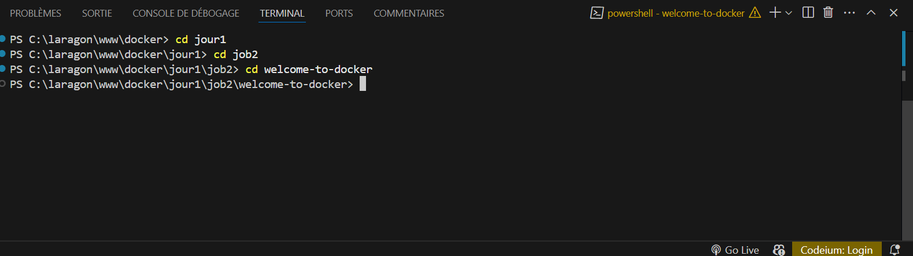
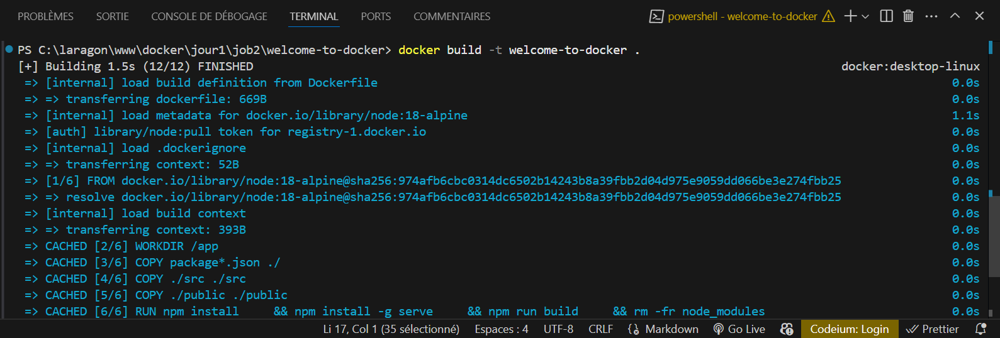

# Guide d'utilisation de Docker avec ce dépôt :

Dans ce guide, nous allons explorer pas à pas comment utiliser Docker en nous basant sur le dépôt suivant :

➡️ [https://github.com/docker/welcome-to-docker](https://github.com/docker/welcome-to-docker)

## 🚀 Étape 1 : Cloner le dépôt

Commencez par cloner le dépôt sur votre machine avec la commande :

```sh
git clone https://github.com/docker/welcome-to-docker.git
```

Ouvrez ensuite le projet dans VSCode.

## 🏗️ Étape 2 : Construire une image Docker

Le projet contient un fichier `Dockerfile`. Nous allons l'utiliser pour générer une image Docker.

1. Ouvrez le terminal dans VSCode en vous assurant que vous êtes bien dans le dossier du projet.



2. Exécutez la commande suivante pour construire l'image Docker :

```sh
docker build -t mon-image-docker .
```



📌 **Explication** :

- `-t mon-image-docker` permet de donner un nom à l'image.
- Le `.` à la fin signifie que le contexte de build est le dossier actuel.

Une fois l’image construite, elle apparaîtra dans Docker Desktop.

## 📦 Étape 3 : Lancer un conteneur à partir de l’image

Après avoir construit l’image, créons un conteneur pour la tester :

```sh
docker run -d -p 8088:3000 --name mon-conteneur-docker mon-image-docker
```

🔹 `-d` permet de lancer le conteneur en arrière-plan.
🔹 `-p 8088:3000` associe le port 3000 du conteneur au port 8088 de votre machine.
🔹 `--name mon-conteneur-docker` donne un nom au conteneur.

Vérifiez que le conteneur fonctionne avec :

```sh
docker ps
```

Enfin, ouvrez votre navigateur et accédez à `http://localhost:8088`.

## 🎨 Étape 4 : Personnalisation de la page

Les fichiers de l’application se trouvent dans `app.js` et `App.css`. Faites vos modifications, puis reconstruisez l’image :

```sh
docker build -t mon-image-docker .
```

Supprimez ensuite l’ancien conteneur et relancez un nouveau :

```sh
docker rm -f mon-conteneur-docker

docker run -d -p 8088:3000 --name mon-conteneur-docker mon-image-docker
```

Rechargez `http://localhost:8088` pour voir les changements.

## 🌍 Étape 5 : Publier l’image sur DockerHub

Pour partager votre image, connectez-vous à DockerHub :

```sh
docker login
```

Ensuite, ajoutez un tag à votre image en remplaçant `mon-utilisateur` par votre nom DockerHub :

```sh
docker tag mon-image-docker mon-utilisateur/mon-repo:latest
```

Puis, poussez l’image vers DockerHub :

```sh
docker push mon-utilisateur/mon-repo:latest
```

Votre image est maintenant disponible pour être partagée !

## 🔄 Étape 6 : Modifier une image existante

Si vous voulez récupérer et modifier l’image d’un autre utilisateur, commencez par la télécharger :

```sh
docker pull nom-utilisateur/image-distant:tag
```

Lancez ensuite un conteneur :

```sh
docker run -d --name conteneur-test -p 8088:3000 nom-utilisateur/image-distant:tag
```

Accédez au terminal du conteneur pour explorer les fichiers :

```sh
docker exec -it conteneur-test sh
```

Identifiez les fichiers sources, puis quittez le terminal avec `exit`.

Copiez ensuite les fichiers sur votre machine :

```sh
docker cp conteneur-test:/app/src/App.js ./src/App.js

docker cp conteneur-test:/app/src/App.css ./src/App.css
```

Apportez vos modifications, puis reconstruisez l’image et publiez-la sous un nouveau nom :

```sh
docker build -t mon-utilisateur/webapp:modif .
docker push mon-utilisateur/webapp:modif
```

🎉 Félicitations, vous avez réussi à utiliser Docker pour construire, modifier et publier des images ! 🚢

