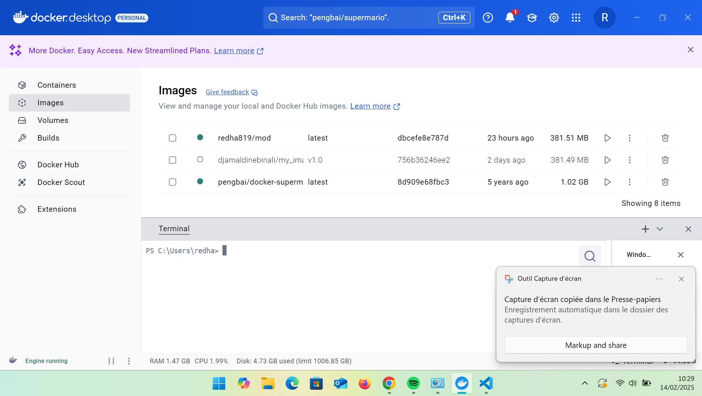
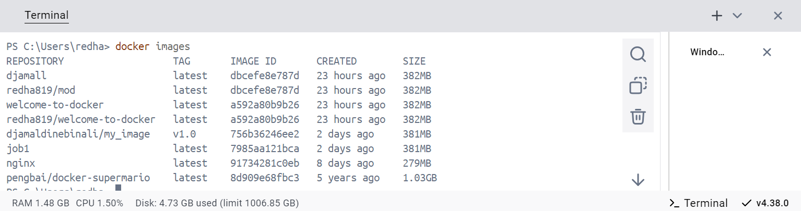
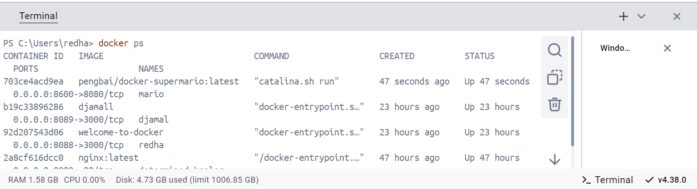
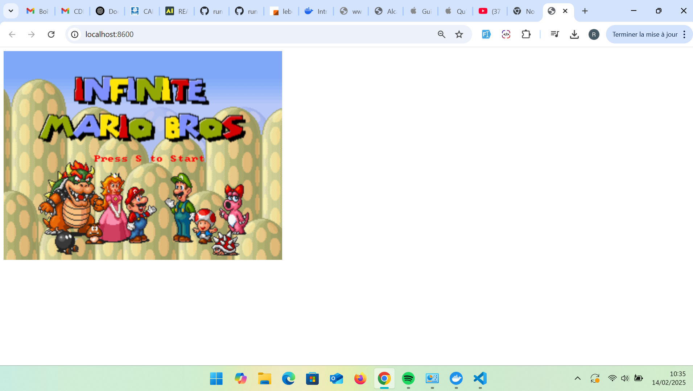
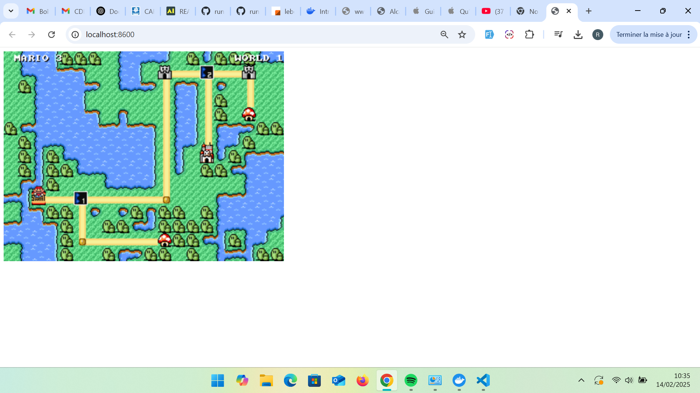
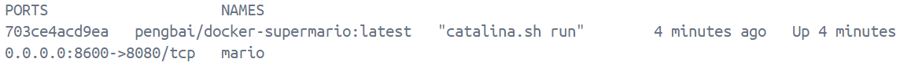
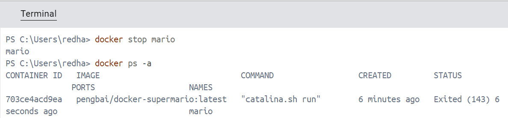
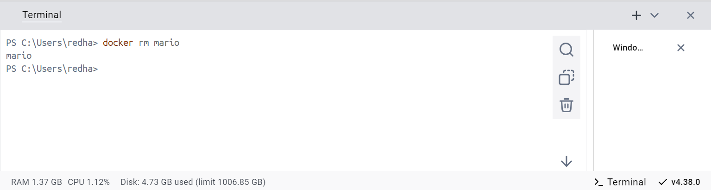
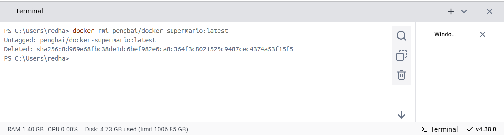

# Docker Super Mario - README

## 📌 Objectif
Ce projet consiste à télécharger, exécuter et manipuler une image Docker de Super Mario (“pengbai/supermario”). Nous allons utiliser Docker Desktop et le terminal pour apprendre les bases de Docker.

## 📂 Structure du projet
```
/docker-supermario
│-- README.md  # Documentation du projet
│-- images/    # Dossier contenant les captures d'écran
```

## 🚀 Étapes du projet

### 1. Préparation
1. **Ouvrir Docker Desktop**
2. **Initialiser un projet Git**
   ```sh
   git init
   ```
3. **Créer un dossier `images/`** pour stocker les captures d’écran

---

### 2. Télécharger et exécuter l'image Docker

1. **Rechercher l’image Docker**
   ```sh
   docker search pengbai/supermario
   ```
 

2. **Télécharger l’image**
   ```sh
   docker pull pengbai/supermario
   ```
   

3. **Vérifier que l’image est bien téléchargée**
   ```sh
   docker images
   ```
   

4. **Lancer un conteneur sur le port 8600**
   ```sh
   docker run -d -p 8600:8080 pengbai/docker-supermario:latest
   ```
   

5. **Vérifier que le conteneur tourne bien**
   ```sh
   docker ps
   ```


---

### 3. Accéder au jeu
1. **Ouvrir le navigateur à l’adresse** : `http://localhost:8600`
2. **Jouer à Super Mario !** 🎮




---

### 4. Gérer le conteneur

1. **Trouver l'ID du conteneur**
   ```sh
   docker ps
   ```
   

2. **Arrêter le conteneur**
   ```sh
   docker stop mario
   ```
   
3. **Supprimer le conteneur**
   ```sh
   docker rm mario
   ```
   
4. **Supprimer l’image Docker**
   ```sh
   docker rmi pengbai/docker-supermario:latest
   ```
   
---

### 5. Documentation et mise en ligne sur GitHub
1. **Ajouter les modifications à Git**
   ```sh
   git add .
   git commit -m "Ajout des étapes du projet"
   ```

2. **Pousser le projet sur GitHub**
   ```sh
   git remote add origin <URL_DU_DEPOT>
   git push -u origin main
   ```

3. **Partager l’URL GitHub avec le formateur**

---

## 🎯 Compétences acquises
✅ Rechercher et télécharger une image Docker  
✅ Exécuter un conteneur avec Docker Desktop et en ligne de commande  
✅ Accéder à une application Docker via le navigateur  
✅ Gérer les conteneurs et images Docker  
✅ Documenter son travail avec un README structuré  
✅ Utiliser Git et GitHub pour le versionnement  

---

## 🔗 Ressources utiles
- [Docker Hub](https://hub.docker.com/)
- [Documentation Docker](https://docs.docker.com/)
- [GitHub Welcome to Docker](https://github.com/docker/welcome-to-docker)

