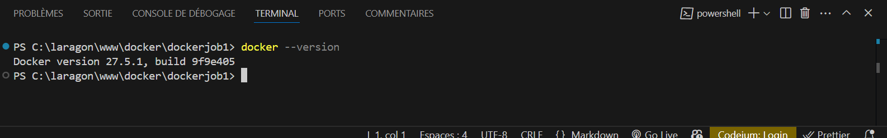
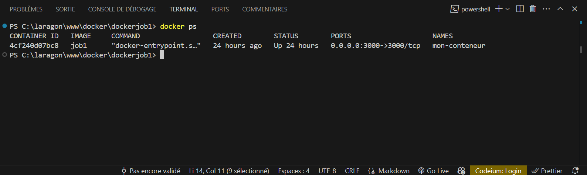
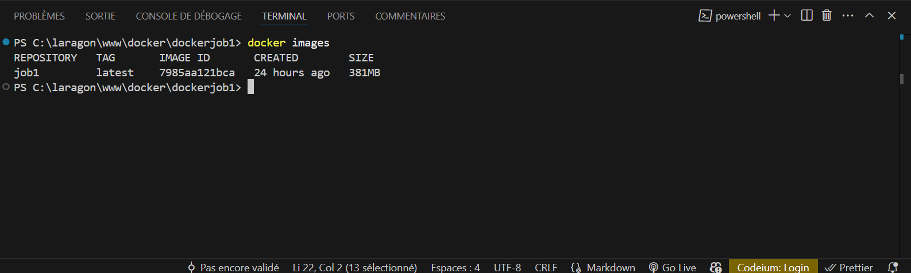
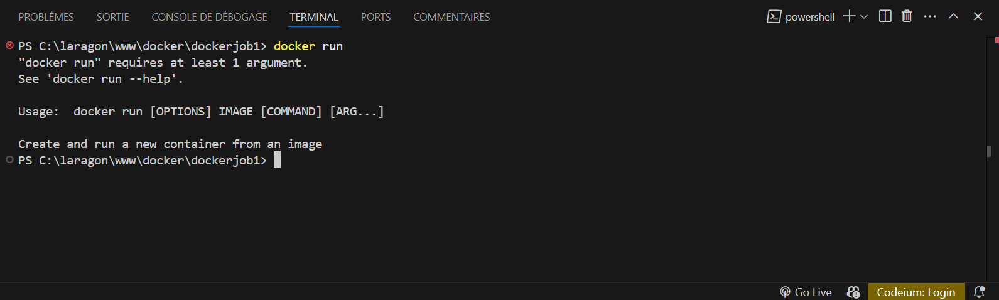
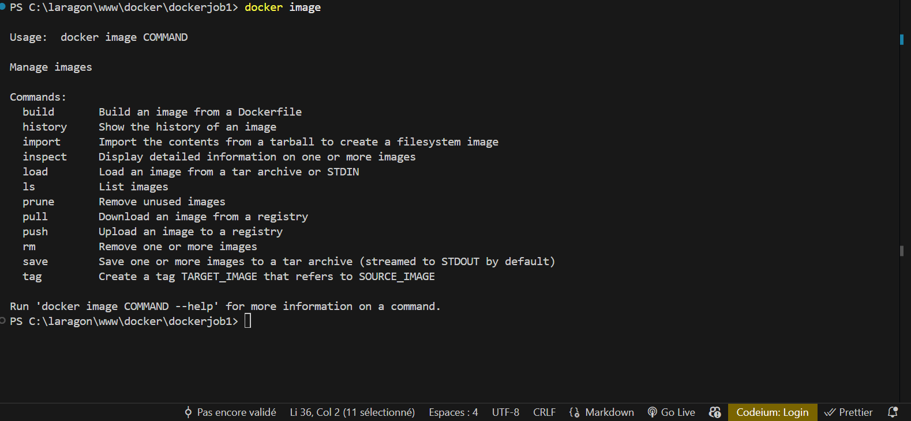

```sh
docker --version
```



```sh
docker info
```     


```sh
 docker ps
 ```
 


 ```sh
 docker images
 ```



 
```sh
 docker run
 ```




 ```sh
 docker stop
```


```sh
 docker images
 ```

 


 Construisez le container Docker


```sh
docker run -it --rm -p xxxx:80 “nom de l’image”
```